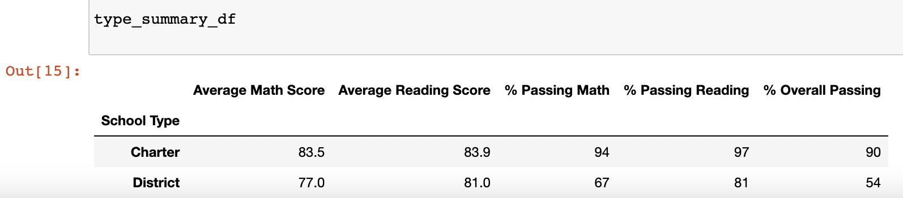

# School_District_Analysis
## Overview:
The purpose of this analysis was to take a collection of 39,000+ students Math and Reading scores and display the trends across Spending/Size/Type of School. There were 15 Schools providing the data including Name/Grade/Scores for all of the students. In the project, the code loads the Data and removes a subset of students scores from the table and begins Calculating and displaying the disctrict summary. The district summary includes Total Students, Total Budget, Average Math Score, Average Reading Score, % Passing Math, % Passing Reading, and % Overall Passing. The code then calculates and delivers a School Summary which displays the 15 schools results for the columns as the previous summary.

## Results:
Using bulleted lists and images of DataFrames as support, address the following questions.

* The district summary is affected in the final five categories with all of the score dropping from .1-.3 points per category with only the Average Reading Scores shooting up .9 points.

.png)
* This is the School Summary that displays the data indexed by Each school in the district. This is before the correction for Thomas High School.

.png)
* The school summary is affected by a data correction for Thomas High School with a 25 percent increase in the last three passing cateogries. 

* With the data correction above, Thomas High School moved to be the second best passing percentage of the 15 schools.

* The Output for the scores by grade for each school is demonstrated by using the .head() function to briefly show a portion of the table.

* Scores by school spending has been broken down into four price bins where the spending per student was used to sort and calculate the averages for each price level.

* Using a similar method to the previous data table, I broke the schools into different size bins to display the averages per student size. 

* In this table, we see the two types of schools displaying their averages with Charter beating District Schools in the overall passing percentage.

## Summary:

+With the modification of the data for Thomas High School, some of our summary tables needed to get updated data. The first script modification was needed to update the metrics for the percentages in the district summary. This resulted in changes in all the percentages moving atmost .3 percentages either way. The second change needed to make the script work for the missing data was to recount all the passsing students for Thomas High School. This could then be used to calculate the percentages for the final three categories. The final step was to replace the changed variables and redisplay the data table with all of the modifications.
